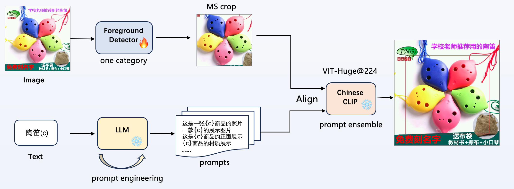

# 2nd Place for Open Vocabulary Detection Contest 

## Method

1. 只使用给定的训练集训练前景检测器，训练了6个检测器进行 wbf 融合，
2. 再对检出的框使用clip模型进行 466 类图文对齐，
3. 使用 LLM 进行 prompt engineering，将最优的 prompt 进行 ensemble，
4. clip 模型融合了 VIT-H@224 和 VIT-L@336 (https://github.com/OFA-Sys/Chinese-CLIP)


## Environment
```
GPU:  Tesla V100 * 8
CUDA: 10.2
Pytorch： 1.8.1
```

```bash
pip install openmim
mim install mmcv-full
cd Universernet/
pip install -v -e .
pip install -r requirements.txt
```

## Data
```
cd ./Data && python gen_fg.py
```
```
├── data_final_contest
│   ├── test
│   └── train
├── gen_fg.py
├── json_final_contest
│   ├── test_fg.json
│   ├── test.json
│   ├── train_fg.json
│   └── train.json
```

## Train
```
cd ./Universernet
bash configs_cmp/ovd2023/train.sh
```


## Submit
```
cd ./Universernet
bash submit/ovd2023/cn_submit_clip.sh
```


